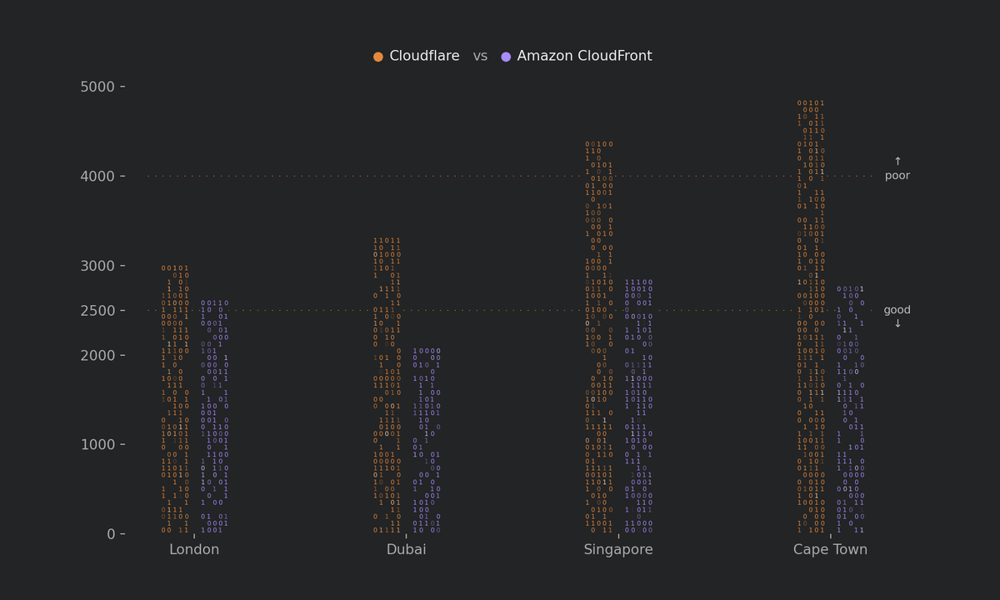

# Binary bars

A bar chart built from ones and zeros. Bar heights carry the data; the bits are
texture. The animation streams the bits down inside fixed-height bars, and
some sparkle, some dissolve. The loop has no seam.



## Run it

Needs Python 3.10+ and ffmpeg on your PATH.

```sh
pip install -r requirements.txt
python binary_bars.py lcp_medians.csv --out chart --row-value 77 --seed 2024 \
    --hline '2500:#719D00:good:down' --hline '4000:#DE5D4D:poor:up'
```

This writes three files:

| File | What | Size here |
|---|---|---|
| `chart.png` | frame 0, 2400 × 1440 | 196 KB |
| `chart.mp4` | 1920 × 1152, 3 loops, 25.7 s | 3.3 MB |
| `chart.gif` | 1200 × 720, 192 frames, 128 colours, loops forever | 4.5 MB |

A full render takes 50 s on an Apple M3 Max. Add `--still-only` to write
`chart.png` and `chart.svg` in a few seconds, without the animation.

## Your own data

A CSV with three columns, one row per bar, in drawing order:

```csv
category,group,value
London,Cloudflare,3049
London,Amazon CloudFront,2653
```

Groups get colours in file order: orange `#E5873B`, then purple `#A68BFE`, equal in OKLCH lightness (0.71).
The subtitle is the legend: each group's name after a dot in its colour.
Pass `--colors` for other colours or more groups.

| Option | Default | Does |
|---|---|---|
| `--row-value` | tallest bar = 63 rows | data units per glyph row |
| `--hline VALUE:COLOR[:LABEL[:up\|down]]` | none | line with a y tick; the label sits past its end, with an optional arrow; repeatable |
| `--line-style` | `dots` | `dots` or `dashes`, 1 px |
| `--seed` | none: new bits every run | fixes the bits |
| `--frames`, `--fps` | 192, 22.4 | loop length; every speed (2, 4, 6) must divide `--frames` |
| `--still-only` | off | PNG and SVG of frame 0 only |
| `--title`, `--xlabel`, `--ylabel` | empty | text |

Motion settings live in the `Motion` dataclass: 5.6% of bits sparkling and 5%
dissolving at any frame, 70% held at full opacity, holes at 4 in 25 on the base
row and 12 in 35 in the body. Layout and colours live in `Style`.

## The data here

`lcp_runs.csv` holds 288 page loads from WebPageTest, 16 May 2024: 2 CDNs ×
4 cities × 4 virtual tours (A–D) × 9 runs. `lcp_medians.csv` is its median
Largest Contentful Paint per city and CDN, the chart's input.

## Tests

```sh
pytest
```

## Licence

Code: [MIT](LICENSE). The chart, the animation, the write-up and the data:
[CC BY 4.0](https://creativecommons.org/licenses/by/4.0/). Credit the author
and link to the page:

```
Aleksey Zabelin, "288 page loads", artdataviz.github.io/generative-dataviz, CC BY 4.0
```
